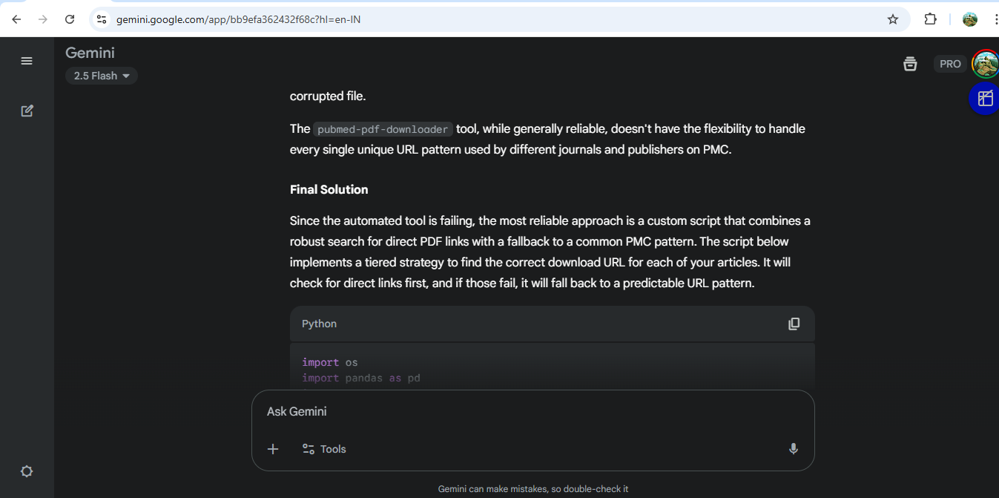
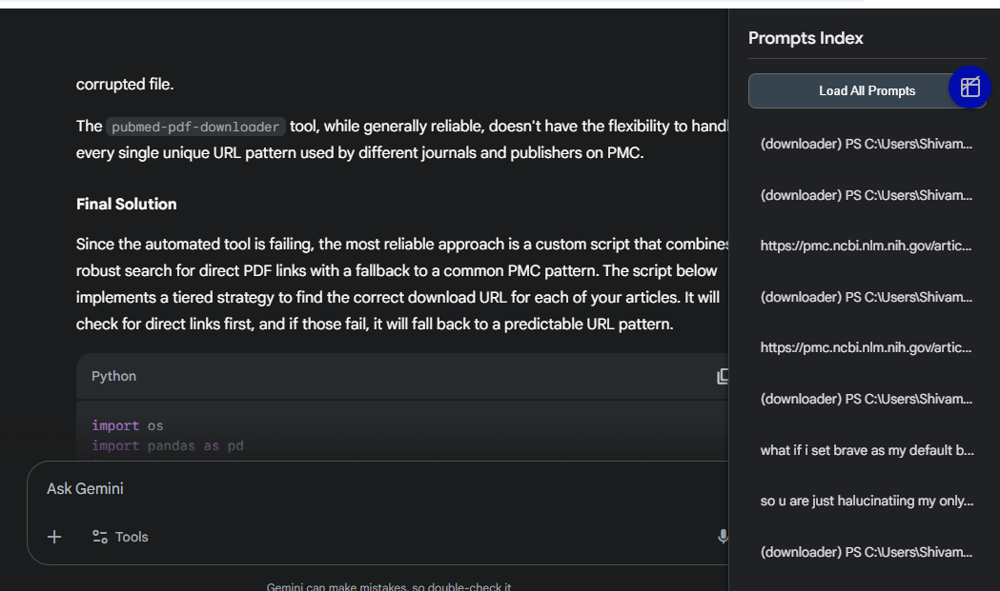
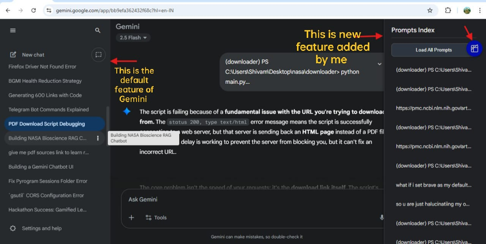
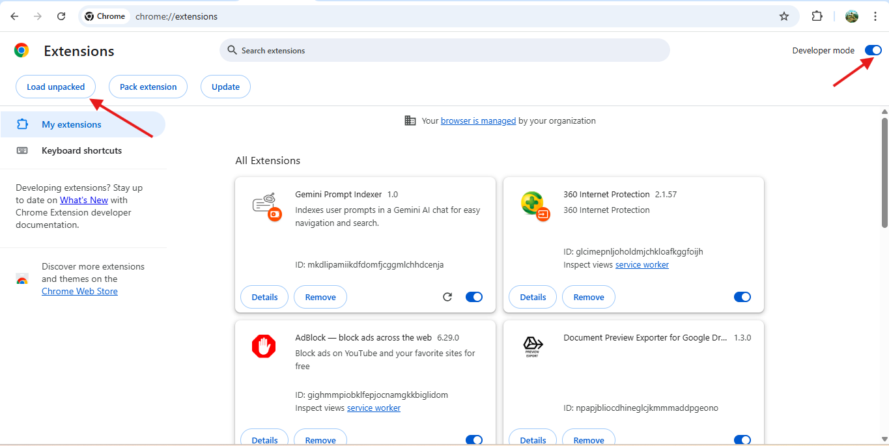

# Gemini AI Prompt Indexer - Chrome Extension

This Chrome extension adds a sidebar that shows the **indexed list of your Gemini AI prompts** for easier navigation.

---

## 🚀 Installation (Free, Manual Method)

Since publishing on the Chrome Web Store requires a developer fee, you can install this extension manually using **Developer Mode**.

### Steps:

1. **Clone this repository**  
   ```bash
  git clone https://github.com/ShivamMMMxyz/GeminiPromptsIndexer.gi
or download it as a ZIP file and extract it.

Open Chrome Extensions Page

In Chrome, go to:

arduino
Copy code
chrome://extensions/
Enable Developer Mode

Toggle the Developer mode switch (top-right corner).

Load the Extension

Click Load unpacked.

Select the folder where you cloned/extracted the extension.

✅ Done!

The extension will now appear in your extensions list.

Pin it from the extensions toolbar for quick access.


⚡ Usage
Open Gemini AI chat in Chrome.

The sidebar will show all your user prompts with their index numbers.

Click a prompt in the sidebar to quickly navigate.

## 📸 Screenshots

### 1. Extension Button in top left
[](screenshot/s1.png)

### 2. Sidebar Appears in Gemini AI  
[](screenshot/s2.png)


### 3. Final Working Example  
[](screenshot/s4.jpg)

### 4. chrome://extensions/  page settings 
[](screenshot/s3.png)


🛠️ Notes
This extension is for personal use.

If you want to publish it on the Chrome Web Store, you’ll need a Google Developer account ($5 one-time fee).

⭐ If you find this useful, consider giving the repo a star!